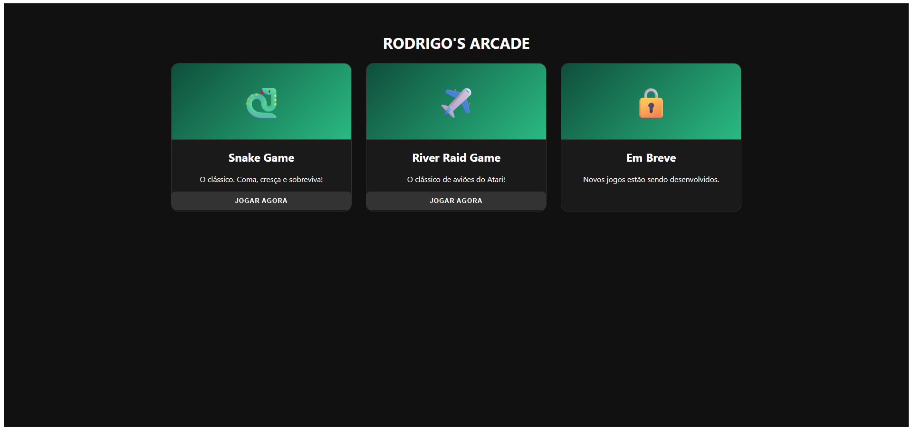
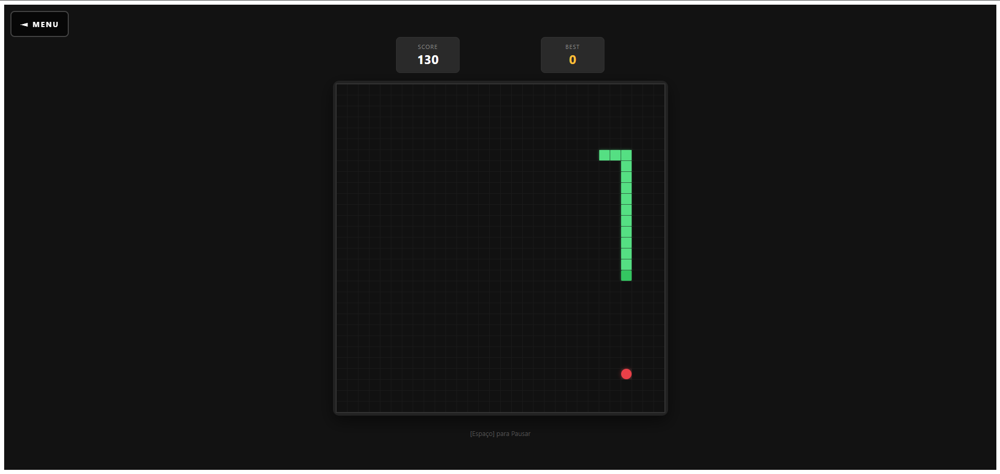
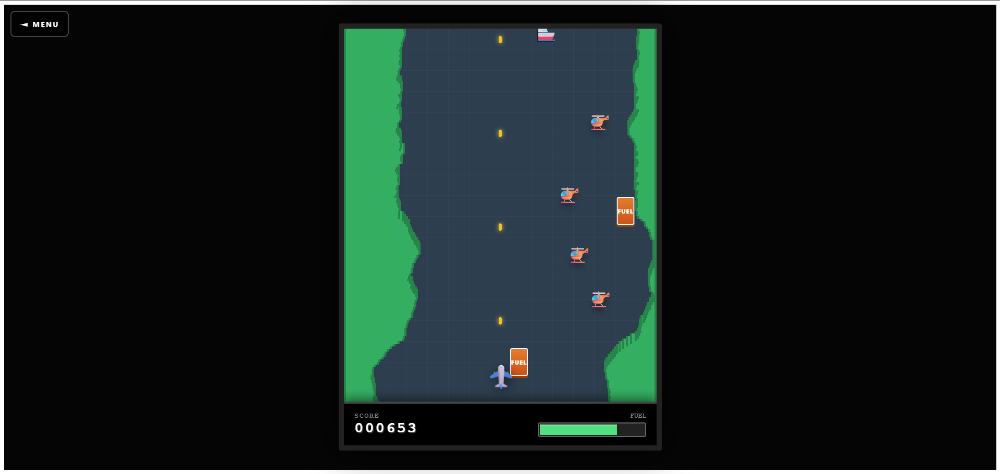

# 🕹️ Rodrigo's Arcade

Um portfólio interativo de jogos retro desenvolvidos nativamente no navegador utilizando **Angular** moderno. Este projeto demonstra a aplicação de padrões de arquitetura escaláveis, gerenciamento de estado reativo e otimização de performance para renderização de frames em tempo real.


<div align="center">
  
</div>

---

## 🎮 Jogos Inclusos

### 1. Snake Classic 🐍
O clássico jogo da cobrinha, reimaginado com uma arquitetura baseada em grid e controle de estado reativo.
- **Destaques:** Sistema de pontuação, power-ups e aumento progressivo de dificuldade.

<div align="center">
  
</div>

### 2. River Raid (Atari Tribute) ✈️
Um motor de física contínua com rolagem vertical infinita.
- **Mecânica:** Geração procedural do mapa (o rio nunca se repete) e sistema de auto-fire contínuo.
- **Tecnologia:** - Loop de renderização a 60 FPS executado via `requestAnimationFrame` fora do Angular Zone (`NgZone.runOutsideAngular`) para máxima performance.
  - Sistema de colisão AABB com *Hitbox Padding* para uma experiência de jogo mais justa e fluida.
  - Sistema de Entidades (Inimigos, Combustível, Projéteis).
  - Animações otimizadas via GPU (`will-change: transform`).

<div align="center">
  
</div>

### 3. Checkers (Damas) ♟️ *(Em Desenvolvimento)*
- **Foco:** Inteligência Artificial e algoritmos de tomada de decisão utilizando **Minimax**.

---

## 🏗️ Arquitetura do Projeto

O código foi estruturado focando em escalabilidade e separação de responsabilidades (Modular Monolith):

```text
src/app/
├── core/                  # Serviços Singleton e Store global (Configurações, Áudio)
├── features/              # Módulos independentes encapsulados
│   ├── home/              # Interface do Arcade Dashboard
│   ├── snake-game/        # Lógica de Grid e UI do Snake
│   └── river-raid/        # Engine de Física e UI do River Raid
└── shared/                # Componentes reutilizáveis (ex: Arcade Back Button)
```

### Principais Padrões Utilizados

- **Angular Signals:** Gerenciamento de estado reativo, performático e livre de vazamentos de memória.
- **Standalone Components:** Arquitetura sem NgModules para maior clareza e carregamento otimizado.
- **Lazy Loading:** Os jogos são carregados sob demanda através do roteamento do Angular.
- **SCSS:** Estilização componentizada com aninhamento, variáveis e foco no tema Retro/Neon.

## 🚀 Como Executar Localmente

1. Clone o repositório e instale as dependências:

   ```bash
   npm install
   ```
   
2. Inicie a aplicação que já deve abrir o navegador:

   ```bash
   npm run start
   ```

<div align="center">
<p>Desenvolvido com 💻 e ☕ por <strong>Rodrigo Silveira dos Santos</strong></p>
<p>© 2026 Todos os direitos reservados.</p>
</div>
